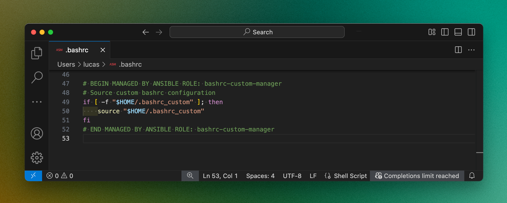

# Ansible Role: Bashrc Custom Manager

This Ansible role copies custom bashrc configurations from the Ansible host to multiple other hosts. It creates and maintains a custom bashrc file sourced from the main .bashrc, ensuring consistent shell customizations across your infrastructure.

## Features

- Copy a custom bashrc to each host
- Source user can be configured
- Custom file name can be configured

## Screenshot


## Requirements

- Ansible 2.9 or higher
- Write access to the target user's home directory
- Bash as the default shell on target hosts

## Role Variables

Available variables are listed below, along with default values (see `defaults/main.yml`):

| Variable | Type | Description | Default |
|----------|------|-------------|---------|
| source_host | str | Host where custom bashrc is sourced from | "localhost" |
| source_user | str | User whose custom bashrc is sourced | "ansible" |
| target_user | str | User who will receive the custom bashrc | "ansible" |
| bashrc | str | Main bashrc file name | ".bashrc" |
| bashrc_custom | str | Custom bashrc file name | ".bashrc_custom" |

## Dependencies

No dependencies on other roles.

## Example Playbook


```yaml
- hosts: all
  roles:
    - role: ansible-role-bashrc-custom-manager
      vars:
        target_user: "root"  # Install custom bashrc for root user
```

## Testing


To test the role:

```bash
ansible-playbook tests/test.yml -i tests/inventory.ini
```

The test playbook will:
1. Create test directories and files
2. Apply the role
3. Verify the custom bashrc configuration
4. Clean up test artifacts

## Inventory Example

Here's an example inventory file format that works with this role:

```ini
[servers]
dev01    ansible_host=192.168.1.10
staging  ansible_host=192.168.1.11
prod     ansible_host=192.168.1.12

[servers:vars]
ansible_user=devops
ansible_home=/home/devops
```

## License

MIT

## Contributing

1. Fork the repository
2. Create a feature branch (`git checkout -b feature/my-new-feature`)
3. Commit your changes (`git commit -am 'Add some feature'`)
4. Push to the branch (`git push origin feature/my-new-feature`)
5. Create a new Pull Request

## Author Information

Lucas Janin
- Mastodon: [https://mastodon.social/@lucas3d](https://mastodon.social/@lucas3d)
- Website: [https://www.lucasjanin.com](https://www.lucasjanin.com)
- GitHub: [github.com/lucasjanin](https://github.com/lucasjanin)
- LinkedIn: [linkedin.com/in/lucasjanin](https://linkedin.com/in/lucasjanin)